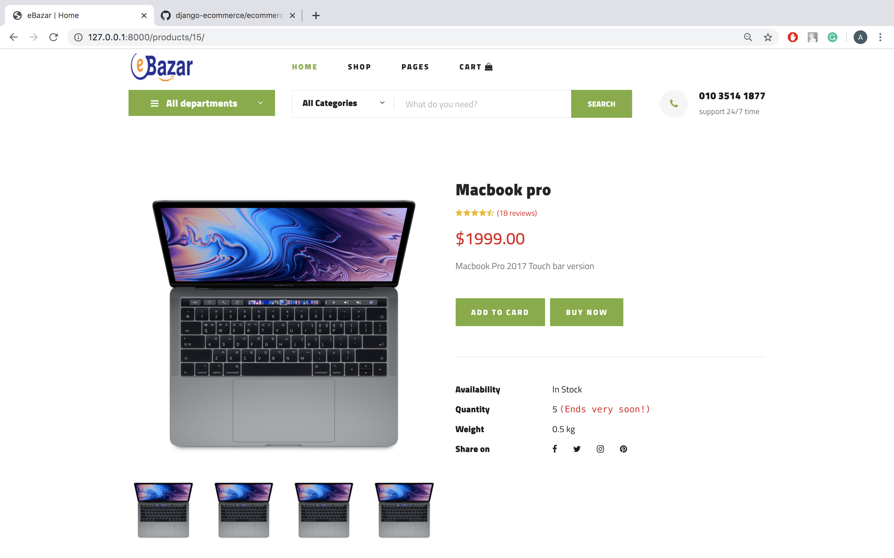
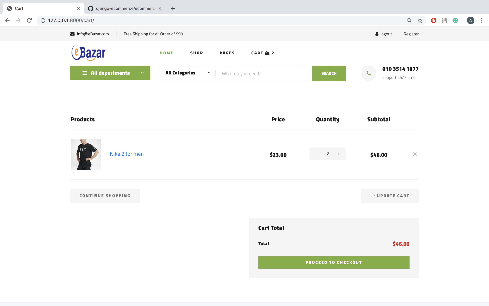

<h1>eCommerce using Django(3.0) and MySQL</h1>

Simple yet Beautiful eCommerce application created with Django and MySQL.
    It has 2 user type:
    <ol>
        <li>Admin - can take control of all the stuff. For example
            <ul>
                <li>Create/Update/Delete products</li>
                <li>Can see user emails, names(not passwords!)</li>
            </ul>
        </li>
        <li>Customers - can the following:
            <ul>
                <li>Register</li>
                <li>Login/Logout</li>
                <li>Buy/Sell(Create products)</li>
                <li>Add to cart</li>
                <li>Remove from cart</li>
                <li>Edit profile</li>
            </ul>
        </li>
    </ol>

To use this project you need to configure DB settings in ecommerce > ecommerce > settings.py

<h1>Snapchots from the project</h2>
<table>
    <tr>
        <td>
            <h4>Home</h4>
            
        </td>
        <td>
            <h4>Shop Page</h4>
            
        </td>    
    </tr>
    <tr>
        <td>
            <h4>Product Detail</h4>
            
        </td>
        <td>
            <h4>Cart</h4>
            
        </td>
    </tr>
    <tr>
        <td>
            <h4>Login</h4>
            
        </td>
        <td>
            <h4>Sign up</h4>
            
        </td>
    </tr>
    <tr>
        <td>
            <h4>Admin Dashboard</h4>
            
        </td>
        <td>
            <h4>Admin Create Product</h4>
            
        </td>
    </tr>
    <tr>
        <td>
            <h4>Admin - Userlist</h4>
            
        </td>
    </tr>
</table>

<h1>Requirements to use!</h1>

To run this project on your local machine you need to do the following:
<ol>
    <li>you need to have python3 and django -version 3 installed on your machine</li>
    <li>you need to have MySQL installed on your machine</li>
    <li>need to have a MySQL database named 'ecommerce'</li>
    <li>enter your database password, id, port, db name in settings.py</li>
    <li>type: pip3 -r install requirements.txt (pip3 because this project runs on python3 and django version 3)</li>
    <li>go to commandline on windows or terminal on mac</li>
    <li>type: cd /django-ecommerce/</li>
    <li>type: source env/bin/activate - (to activate virtual env)</li>
    <li>type: cd ecommerce/</li>
    <li>type: python3 manage.py makemigrations</li>
    <li>type: python3 manage.py migrate</li>
    <li>type: python3 manage.py runserver</li>
</ol>

